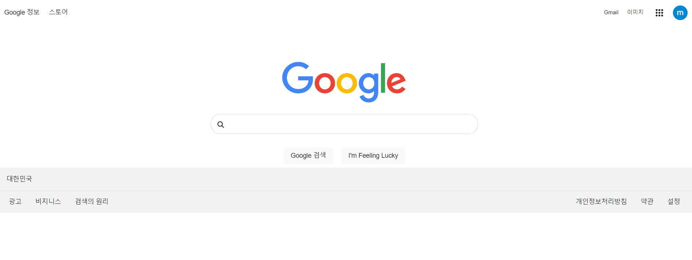
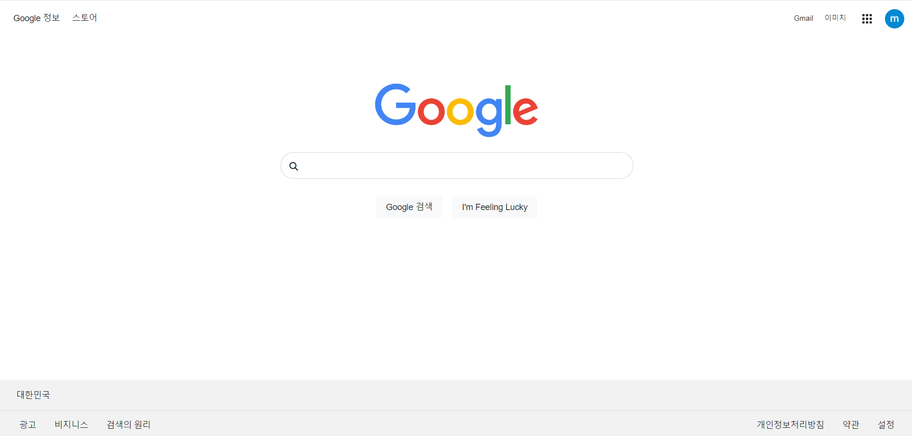

# 구글 메인 페이지 디자인 클론 코딩
* 디자인을 보고 태그 및 레이아웃과 화면을 구현합니다.
* 기간 : 2024-04-15 ~ 2024-04-17
* tailwind css를 사용하여 만들어 보는 것이 목표입니다.

## 기술 스택
[](https://developer.mozilla.org/en-US/docs/Web/HTML)
[](https://developer.mozilla.org/en-US/docs/Web/CSS)
[](https://twailwindcss.com)
[](https://vitejs.dev)

## 🆕 UX 기능 구현
* hover 했을 때, 마우스 포인터 커서로 변경
* 검색창 hover 했을 때, box shadow
* 링크 관련 아이콘 hover 했을 때, underline 추가
* 버튼에 마우스 hover 했을 때, box shadow 지정

## 🚀 트러블 슈팅
* 문제: 구글 화면에서 footer를 아래에 고정시켜야 하는 방법이 필요했습니다.

1. `absolute 포지션`을 사용해서 해결하려고 했지만, 컨텐츠가 길고 스크롤이 생기게 되면 문제가 생깁니다.<br><br>
2.`flex` 와 `wrap 래핑해주는 div`를 사용하기.<br><br>
```html
    <head>
    <!-- 헤드 타이틀, 헤드 캐시 등등 해더 데이터들-->
    <meta name="viewport" content="width=device-width, initial-scale=1.0"/>
    </head>
    <body class="m-0 p-0 h-full">
        <div class="flex flex-col h-screen container-wrap">
            <!--... 섹션들 Header 부분, Content부분 등등-->
            <div class="flex-grow"></div>
            <footer>
                푸터 내용~
            </footer>
        </div>
    <body>
```

1. `flex-direction: column`과 `height: 100% or 100vh`을 사용하면 사용자 화면을 가득 채울 수 있습니다.<br><br>

2. 헤더에 `뷰포트 설정`은 필수로 집어 넣어야 합니다. vh는 뷰 포트 기준입니다!.<br><br>

3. flex-grow : 1 옵션을 통해서 컨텐츠와 height 100% 사이 빈 여백을 자연스럽게 늘려줍니다.


## 개선된 화면


### 사용하고 느낀 tailwind css 장점

1. 아무래도 빠르게 익숙해진다면 UI 개발 시간이 많이 단축될 것이라고 생각합니다.<br><br>
2. 클래스명을 고민할 필요가 적어져 개발 속도가 빨라집니다.<br><br>
3. 아마 앞으로도 사이드 프로젝트는 tailwindcss로 작업을 진행할 것 같습니다. 

### tailwind css의 단점

1. inline style을 사용하기 때문에 tailwind css에 익숙하지 않다면 코드를 보는 것이 편하지 않습니다.<br><br>
2. css 동작을 확인하기 위해서 inline style에 작성된 문자열을 모두 읽고 분석해야 하는 것이 번거롭습니다.<br><br>
3. 그래도 bootstrap의 알 수 없는 사전 스타일 지정 UI에 대한 에러의 대안으로는 tailwind css가 충분한 대안이 될 수 있다고는 생각이 들었습니다.

### 배운점

1. 대부분 사이트에서 큰 레이아웃을 감싸는 박스가 왜 필요한지 다시 생각하게 되었습니다.<br><br>

2. flex를 활용한 레이아웃 만들기에서 grow와 shrink에 대하여 조금 더 익숙해진 시간이였습니다.<br><br>

3. tailwind.config.js 에서 css 커스텀하게 설정할 수 있는 점은 좋았습니다.

### 아쉬운점

1. tailwind css를 처음 사용해보니까 익숙하지 않는 부분을 inline style 방식으로 처리한 부분이 존재합니다..<br><br>
2. 다음 클론코딩은 inline style을 tailwind.config.js 파일에서 설정하고 자주 사용될만한 css 스타일은 전역으로 관리해보려고 합니다.


